# BANSA PostgreSQL ER Diyagramı

Bu model kampanyalar ile standart finansman ürünlerini aynı veritabanında fakat **ayrı varlıklar** olarak tutar. Ortak banka ve resmî kaynak sayfaları tekrar edilmez.

```mermaid
erDiagram
    BANKS ||--o{ SOURCE_PAGES : "sahiptir"
    SOURCE_PAGES ||--o{ SOURCE_PAGE_SNAPSHOTS : "sürümleri"

    BANKS ||--o{ CAMPAIGNS : "yayınlar"
    SOURCE_PAGES ||--o{ CAMPAIGNS : "kaynak"
    CAMPAIGNS ||--o| CAMPAIGN_FINANCE_DETAILS : "finans detayı"
    CAMPAIGNS ||--o{ CAMPAIGN_BENEFITS : "avantaj"
    CAMPAIGNS ||--o{ CAMPAIGN_AUDIENCES : "hedef kitle"
    CAMPAIGNS ||--o{ CAMPAIGN_INSTALLMENT_TERMS : "taksit koşulu"
    CAMPAIGNS ||--o{ CAMPAIGN_CHANGE_EVENTS : "değişiklik"

    BANKS ||--o{ STANDARD_PRODUCTS : "sunar"
    PRODUCT_FAMILIES ||--o{ STANDARD_PRODUCTS : "sınıflandırır"
    SOURCE_PAGES ||--o{ STANDARD_PRODUCTS : "kaynak"
    STANDARD_PRODUCTS ||--o{ PRODUCT_AMOUNT_MATURITY_RULES : "tutar-vade"
    STANDARD_PRODUCTS ||--o{ PRODUCT_CATEGORY_RULES : "kategori"
    STANDARD_PRODUCTS ||--o{ PRODUCT_PRICING_TIERS : "fiyatlama"
    STANDARD_PRODUCTS ||--o{ PRODUCT_FEE_RULES : "masraf"
    STANDARD_PRODUCTS ||--o{ PRODUCT_OFFER_RULES : "özel koşul"
    STANDARD_PRODUCTS ||--o{ PRODUCT_FEATURES : "nitel özellik"
    STANDARD_PRODUCTS ||--o{ PRODUCT_CHANGE_EVENTS : "değişiklik"
    STANDARD_PRODUCTS ||--o| PRODUCT_SCAN_STATE : "tarama durumu"

    BANKS ||--o{ SYNC_RUNS : "tarama"
    BANKS ||--o{ CLASSIFICATION_OVERRIDE_LOG : "override"

    BANKS {
        bigint id PK
        text name UK
        text slug
        boolean is_active
    }
    SOURCE_PAGES {
        bigint id PK
        bigint bank_id FK
        text url UK
        text clean_text
        text content_hash
        boolean is_current
    }
    CAMPAIGNS {
        bigint id PK
        bigint legacy_live_id UK
        bigint bank_id FK
        bigint source_page_id FK
        text campaign_name
        text campaign_category
        date start_date
        date end_date
        text current_status
        boolean is_current
    }
    STANDARD_PRODUCTS {
        bigint id PK
        bigint legacy_live_id UK
        bigint bank_id FK
        bigint family_id FK
        bigint source_page_id FK
        text product_name
        numeric minimum_financing_amount
        numeric maximum_financing_amount
        integer maximum_maturity_months
        numeric profit_share_rate
        boolean is_current
    }
    PRODUCT_FAMILIES {
        bigint id PK
        text family_key UK
        text family_name
    }
    CAMPAIGN_BENEFITS {
        bigint id PK
        bigint campaign_id FK
        text benefit_type
        numeric amount
        numeric rate
    }
    CAMPAIGN_AUDIENCES {
        bigint id PK
        bigint campaign_id FK
        text audience_type
        text audience_label
    }
    PRODUCT_AMOUNT_MATURITY_RULES {
        bigint id PK
        bigint product_id FK
        numeric min_amount
        numeric max_amount
        integer max_maturity_months
    }
    PRODUCT_CATEGORY_RULES {
        bigint id PK
        bigint product_id FK
        text category_label
        integer max_installments
        integer max_maturity_months
    }
    PRODUCT_PRICING_TIERS {
        bigint id PK
        bigint product_id FK
        integer maturity_months
        numeric profit_share_rate
        numeric allocation_fee_rate
        text pricing_variant
    }
    PRODUCT_FEATURES {
        bigint id PK
        bigint product_id FK
        text feature_key
        text feature_value
    }
```

## Ana tasarım kararı

- `BANKS`: banka adı bir kez tutulur.
- `SOURCE_PAGES`: resmî URL ve son doğrulanmış sayfa metni bir kez tutulur. Aynı sayfadan birden fazla embedded ürün çıkabilir.
- `CAMPAIGNS`: sadece kampanya varlıkları.
- `STANDARD_PRODUCTS`: sadece standart finansman ürünleri.
- Ürün vade/fiyat/masraf/kategori gibi çoklanan bilgiler ayrı rule tablolarındadır.
- `*_CHANGE_EVENTS`: banka sitesi değiştiğinde eski/yeni durumu izler.
- `PRODUCT_SCAN_STATE`: tek eksik taramada silmeme (safe removal) mantığını korur.
